# 🧩 SudokuSen

**Ein modernes Sudoku-Spiel für Desktop – entwickelt mit Godot 4 & C#**

---

## 🏠 Willkommen

SudokuSen bietet ein elegantes, benutzerfreundliches Sudoku-Erlebnis mit mehreren Schwierigkeitsstufen, intelligenten Hinweisen und umfangreichen Statistiken.

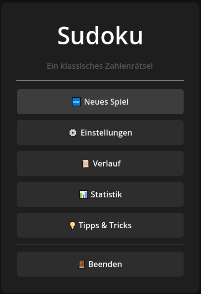

### Hauptmenü-Features:
- 🆕 **Neues Spiel** – Starte ein frisches Sudoku
- ▶️ **Fortsetzen** – Setze dein laufendes Spiel fort
- 📊 **Statistik** – Verfolge deine Fortschritte
- 📜 **Verlauf** – Siehe alle gespielten Partien
- 💡 **Tipps & Tricks** – Lerne Sudoku-Strategien
- ⚙️ **Einstellungen** – Passe das Spiel an deine Vorlieben an

Falls eine bestehende Partie offen ist, kannst du diese mit `Spiel fortsetzen` weiterspielen.

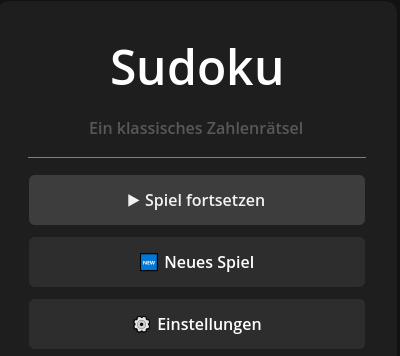

---

## 🎯 Schwierigkeitsstufen

Wähle aus vier verschiedenen Schwierigkeitsgraden – vom kinderfreundlichen 4×4 bis zum anspruchsvollen 9×9.

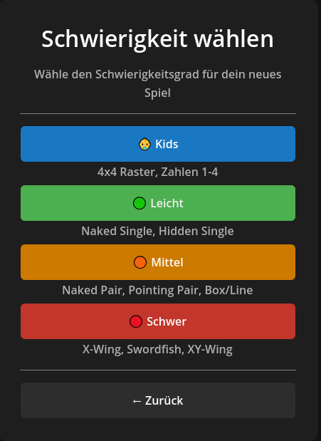

| Stufe | Raster | Beschreibung |
|-------|--------|--------------|
| 👶 **Kids** | 4×4 | Perfekt für Einsteiger und Kinder (Zahlen 1-4) |
| 🟢 **Leicht** | 9×9 | Naked Single, Hidden Single |
| 🟠 **Mittel** | 9×9 | + Naked Pair, Pointing Pair |
| 🔴 **Schwer** | 9×9 | + X-Wing, Swordfish, XY-Wing |

---

## 👶 Kids-Modus

Ein vereinfachtes 4×4-Raster mit großen Zellen – ideal für Kinder und Sudoku-Neulinge.

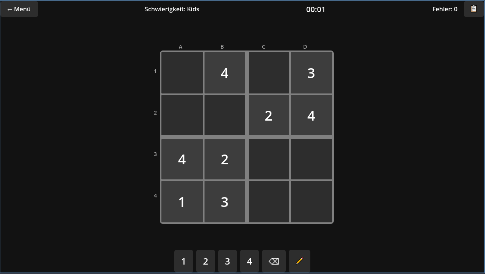

### Kids-Features:
- Übersichtliches 4×4-Gitter mit 2×2-Blöcken
- Nur Zahlen 1-4
- Extra große, gut lesbare Zellen
- Sanfter Einstieg in die Sudoku-Logik

---

## 🎮 Spieloberfläche

Die klassische 9×9-Spielansicht mit allen wichtigen Funktionen auf einen Blick.

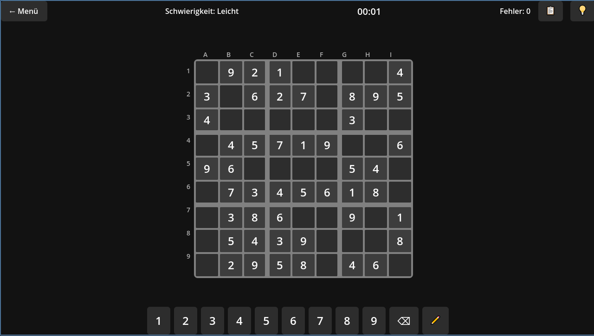

### Spielfunktionen:
- ⏱️ **Timer** – Messe deine Zeit
- ❌ **Fehlerzähler** – Behalte deine Fehler im Blick
- ✏️ **Notizen-Modus** – Markiere mögliche Kandidaten (blau)
- 📋 **Auto-Kandidaten** – Automatische Anzeige aller Möglichkeiten (grau)
- 💡 **Hinweise** – Intelligente Tipps mit visueller Erklärung
- 🔢 **Zahlenpad** – Intuitive Eingabe per Klick oder Tastatur

### Steuerung:
- **Pfeiltasten** – Navigation im Grid
- **Zifferntasten 1-9** – Zahl eingeben
- **N** – Notizen-Modus umschalten
- **Entf/Backspace** – Zahl löschen
- **Ctrl+Klick** – Mehrfachauswahl
- **Shift+Klick** – Bereichsauswahl

### In-Game Features:

- **Zellen hervorheben** - Die ausgewählte Zelle wird hevorgehoben sowie ihre Zeile und Spalte
- **Zahlen hervorheben** - Die selbigen Zahlen der ausgewählten Zelle werden hevorgehoben (hier "4")
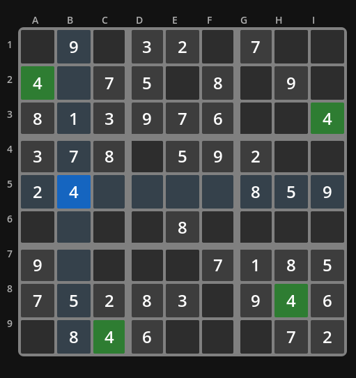
- **Mehrere Zellen markieren** - Mehrere Zellen können markiert werden (ausschließlich für Notizen). Entweder mit Mouse-Dragging oder Mouse-Click + STRG oder Arrow-Keys + SHIFT
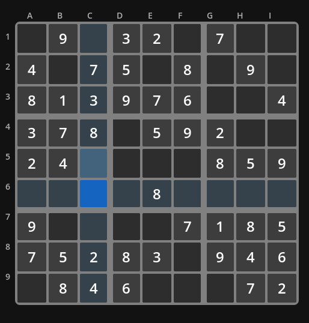
- **On-the-fly Tipps** - Falls du mal nicht weiter weißt, gibt es oben rechts eine `Glühbirne`, die dir Tipps zur aktuellen Lage gibt.
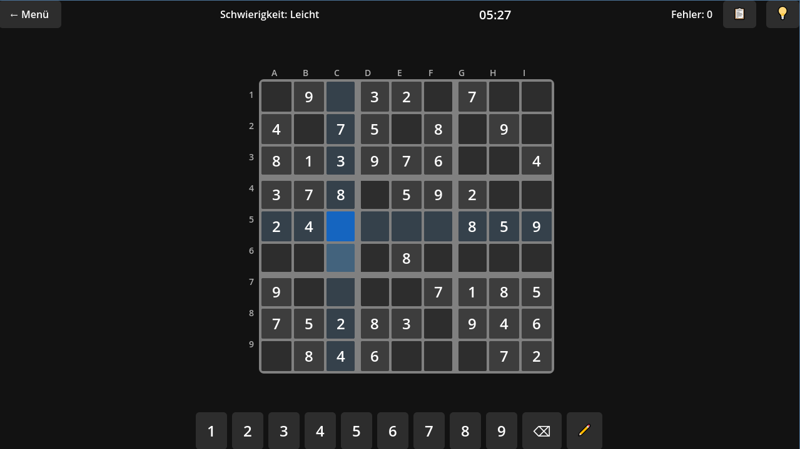
    - Zuerst wird gezeigt, um welche Zelle es geht (vielleicht möchtest du selbst noch knobeln)
    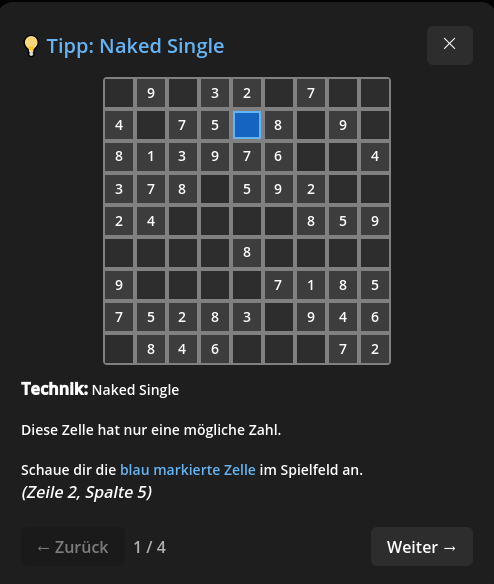
    - Als Zweites wird der Kontext, bspw. relevante Zellen gezeigt, die du dir anschauen kannst ohne die Lösung zu erfahren
    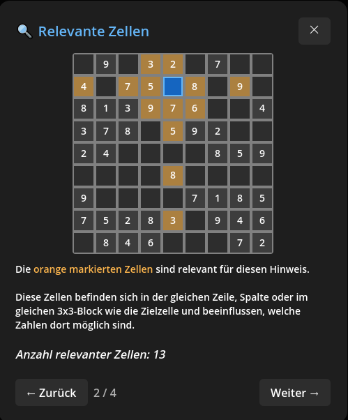
    - Die Lösung ist auf der dritten Seite zu sehen
    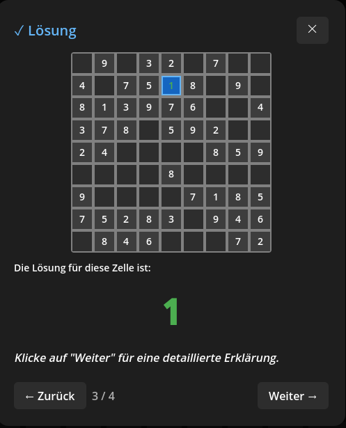
    - Schließlich folgt eine Erklärung auf der vierten und letzten Seite
    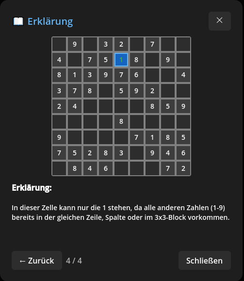
- **Notizen-Modus** - Für komplizierte oder längere Spiele sind Notizen hilfreich, um den Überblick zu behalten. Mit der Taste "N" oder über den "Bleistift"-Toggle kann der Notiz-Modus aktiviert werden. Ist er aktiv, werden Zahlen nur als Notiz in die selektieren Zellen eingetragen.
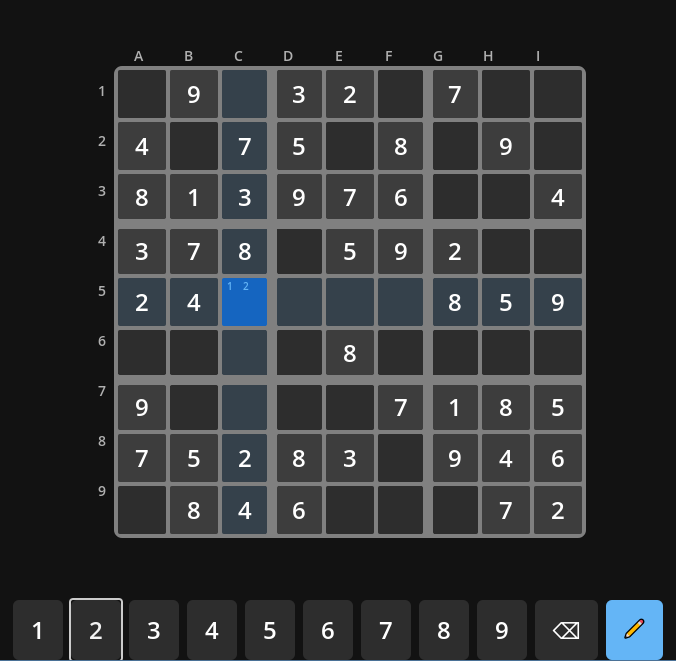

**Hinweis**: Wenn der Notiz-Modus deaktiviert ist und mehrere Zellen selektiert wurden und eine Zahl eingegeben wird, dann wird die eingegebene Zahl nur in der zuletzt selektierten Zelle eingetragen (dunkelblau hervorgehoben, C5).
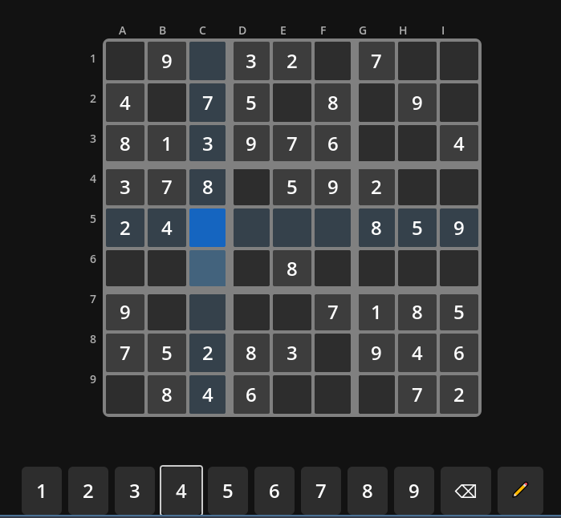

---

## ⚙️ Einstellungen

Passe SudokuSen an deinen Spielstil an.

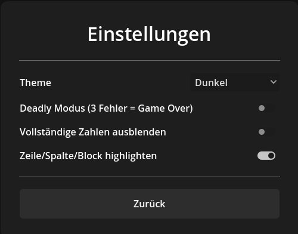

### Optionen:
- 🎨 **Theme** – Hell, Dunkel oder System
- 🔊 **Sound** – Soundeffekte ein/aus
- 💀 **Deadly-Modus** – Bei 3 Fehlern ist das Spiel vorbei
- 🔦 **Verwandte Zellen hervorheben** – Zeigt Zeile/Spalte der ausgewählten Zelle
- 🔢 **Gleiche Zahlen hervorheben** – Markiert alle gleichen Ziffern
- 👁️ **Abgeschlossene Zahlen ausblenden** – Versteckt vollständige Zahlen im Numpad

---

## 📜 Spielverlauf

Behalte den Überblick über alle deine gespielten Partien.

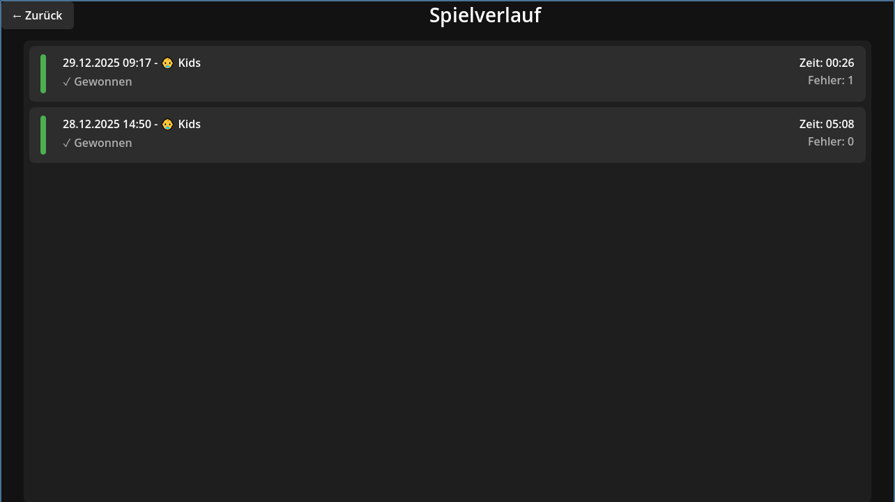

### Verlauf-Features:
- Chronologische Auflistung aller Spiele
- Schwierigkeit, Zeit und Ergebnis auf einen Blick
- Farbcodierung: ✅ Gewonnen | ❌ Verloren | ⏸️ Abgebrochen

---

## 💡 Tipps & Tricks

Lerne fortgeschrittene Sudoku-Techniken mit interaktiven Erklärungen.

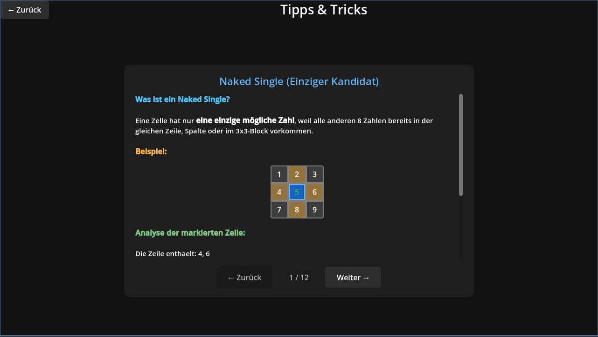

### Enthaltene Techniken:
- **Naked Single** – Nur eine Zahl möglich
- **Hidden Single** – Zahl nur an einer Stelle in Zeile/Spalte/Block
- **Naked Pair** – Zwei Zellen mit gleichen Kandidaten
- **Pointing Pair** – Kandidaten zeigen auf eine Richtung
- **Box/Line Reduction** – Block-Zeilen-Interaktion
- **X-Wing** – Fortgeschrittene Eliminierungstechnik

Jede Technik wird mit einem visuellen Mini-Board erklärt!

---

## 🛠️ Technische Details

| Eigenschaft | Wert |
|-------------|------|
| **Engine** | Godot 4.4 |
| **Sprache** | C# / .NET 8 |
| **Plattform** | Windows (Desktop) |
| **Speicherung** | Lokale JSON-Dateien |

---

## 📥 Installation

1. Lade die neueste Version herunter
2. Entpacke das Archiv
3. Starte `SudokuSen.exe`

**Keine Installation erforderlich – einfach spielen!**

---

### 🎮 Viel Spaß beim Knobeln!

*SudokuSen – Dein persönlicher Sudoku-Begleiter*

