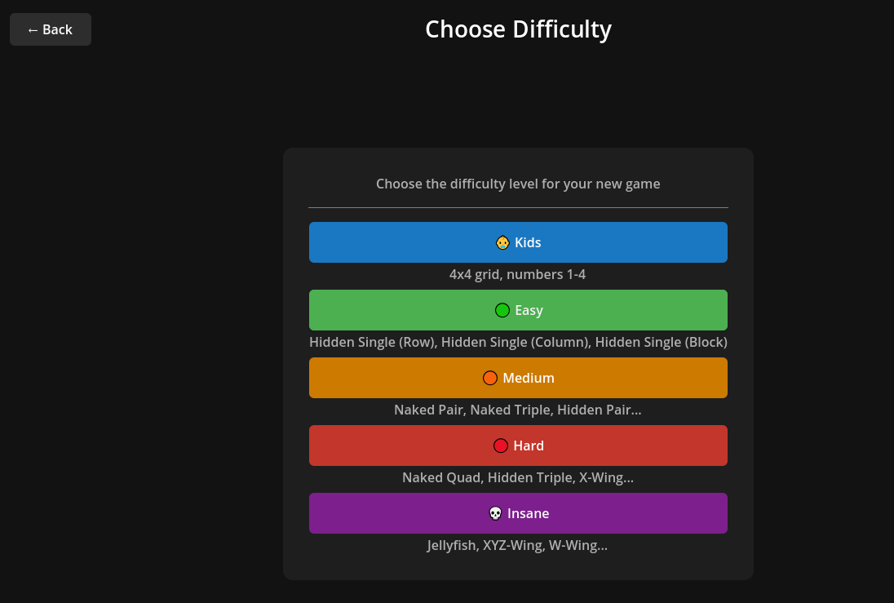
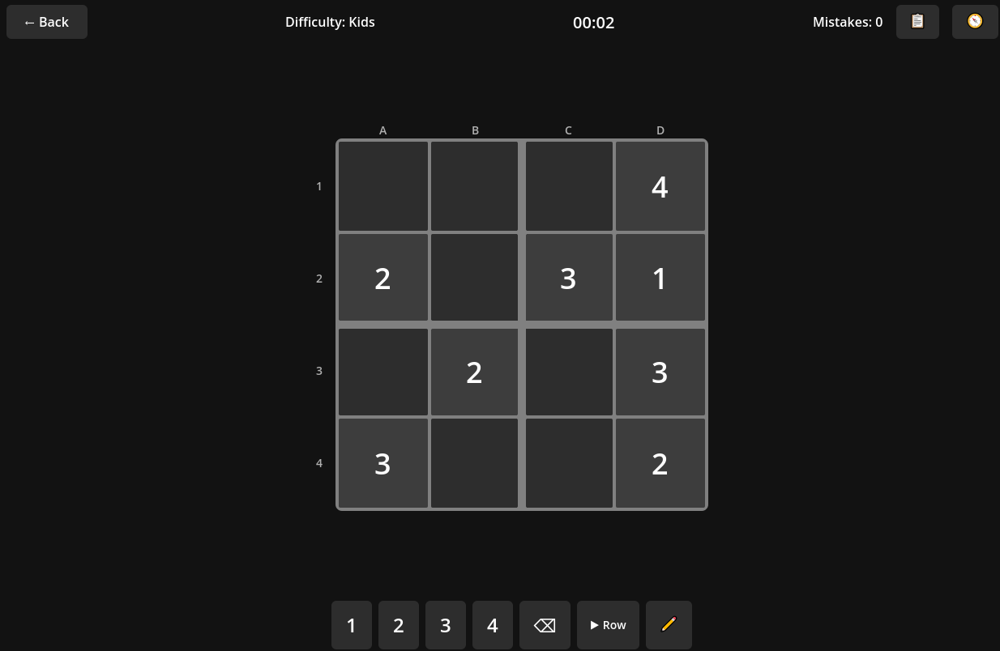
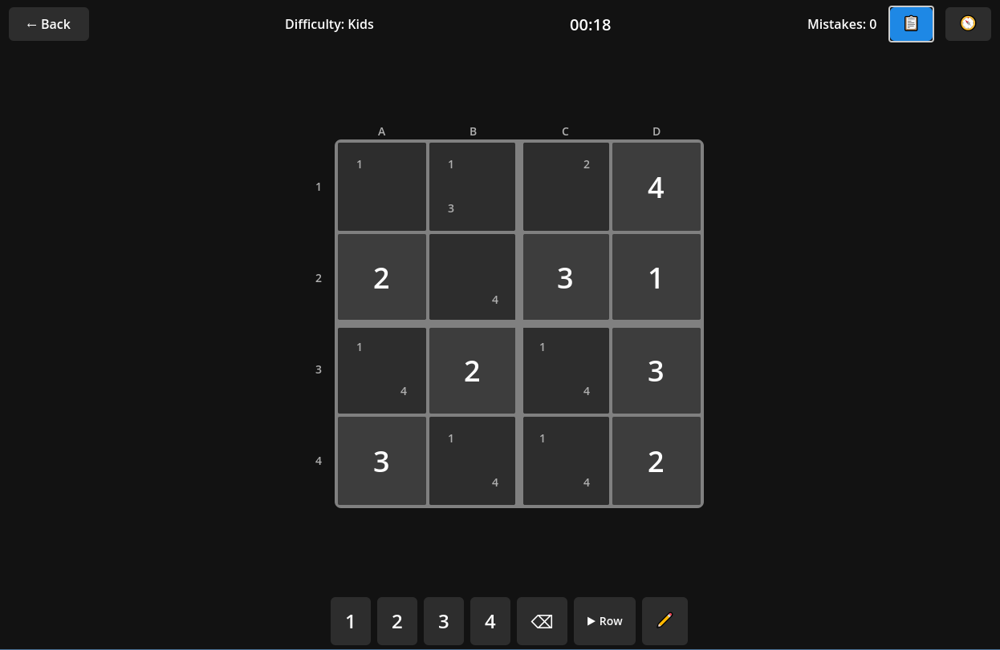
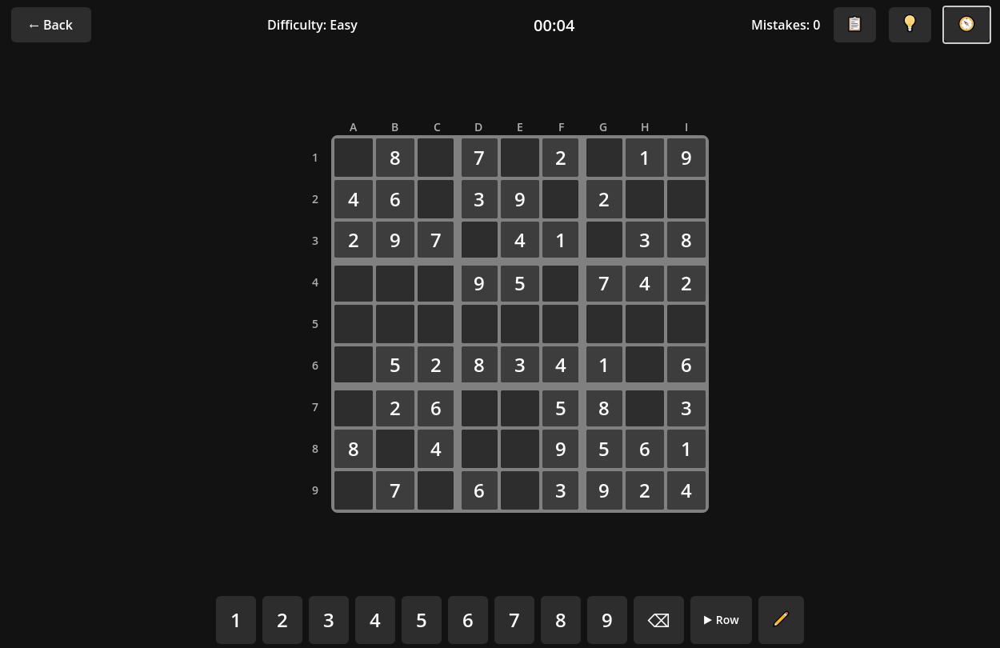
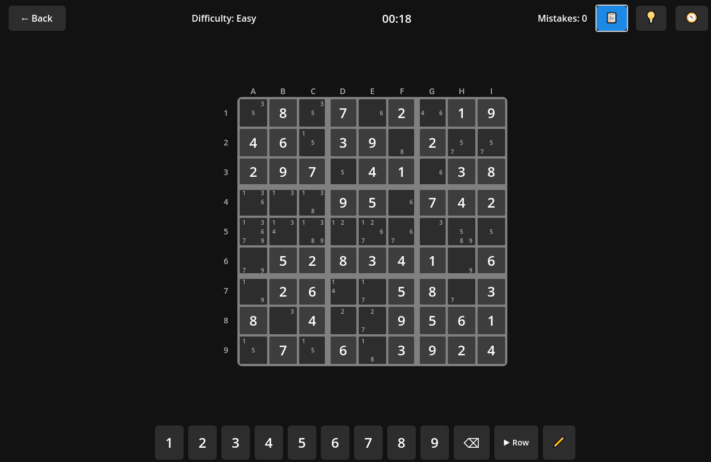
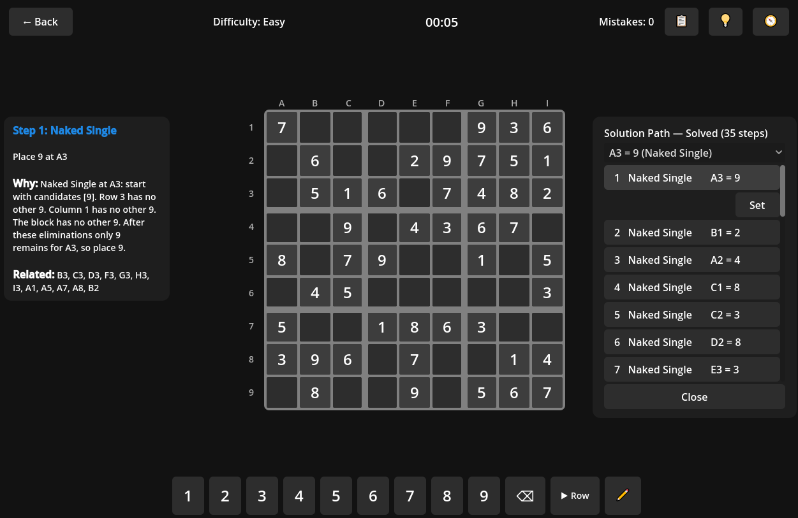
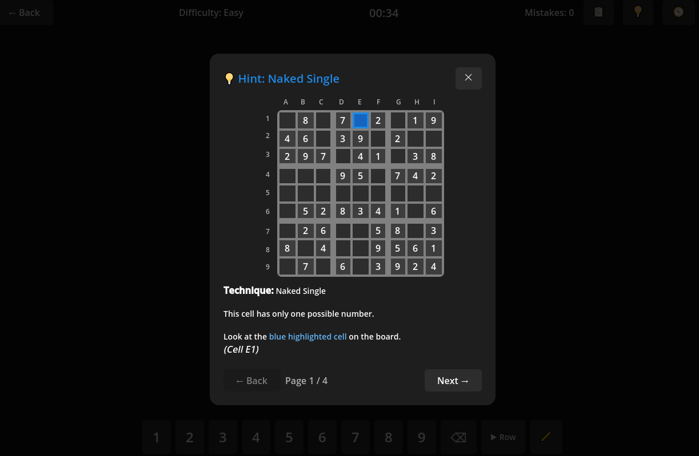
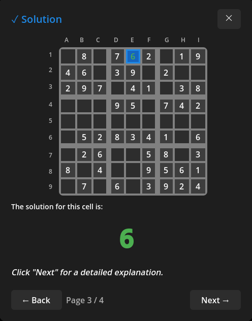

# 🧩 SudokuSen - User Guide

**A modern Sudoku game for Desktop**

*Version 0.0.5*

---

## 📋 Requirements

- **Windows 10/11** (64-bit)
- **.NET 8 Runtime** – Download from [Microsoft](https://dotnet.microsoft.com/download/dotnet/8.0) if not installed

---

## 🏠 Welcome

SudokuSen offers an elegant, user-friendly Sudoku experience with multiple difficulty levels, intelligent hints, and comprehensive statistics.

### Main Menu

The main menu provides all important functions at a glance – now with icons for better overview:

| Menu Item | Icon | Description |
|-----------|------|-------------|
| Continue | ▶️ | Resume your current game |
| New Game | 🆕 | Start a fresh Sudoku |
| Daily Puzzle | 📅 | A new puzzle every day |
| Scenarios | 🎯 | Train specific techniques |
| Tips & Tutorials | 💡 | Learn Sudoku strategies |
| Puzzles | 🧩 | Play pre-built puzzles |
| History | 📜 | View all played games |
| Statistics | 📊 | Track your progress |
| Settings | ⚙️ | Customize the game |
| Exit | 🚪 | Close the game |

If you have an ongoing game, you can continue it directly with **Continue**.

---

## 🎯 Difficulty Levels

Choose from five different difficulty levels – from kid-friendly 4×4 to challenging Insane mode.

| Level | Grid | Clues | Description |
|-------|------|-------|-------------|
| 👶 **Kids** | 4×4 | 8 | Perfect for beginners and children (numbers 1-4) |
| 🟢 **Easy** | 9×9 | 46 | Naked Single, Hidden Single |
| 🟠 **Medium** | 9×9 | 36 | + Naked Pair, Pointing Pair |
| 🔴 **Hard** | 9×9 | 26 | + X-Wing, Swordfish, XY-Wing |
| 💀 **Insane** | 9×9 | 21 | All techniques required |

---

## 👶 Kids Mode

A simplified 4×4 grid with large cells – ideal for children and Sudoku beginners.

### Kids Features:
- Clear 4×4 grid with 2×2 blocks
- Only numbers 1-4
- Extra large, easy-to-read cells
- Gentle introduction to Sudoku logic

Optionally, all candidates can be displayed automatically – helpful for first steps.

---

## 🎮 Game Interface

The classic 9×9 game view with all important features at a glance.

### Game Elements:
- ⏱️ **Timer** – Track your time
- ❌ **Mistake Counter** – Keep track of your errors
- ✏️ **Notes Mode** – Mark possible candidates (blue)
- 📋 **Auto-Candidates** – Automatic display of all possibilities (gray)
- 💡 **Hints** – Intelligent tips with visual explanation
- 🔢 **Number Pad** – Intuitive input via click or keyboard
- 🛤️ **Solution Path** – Shows all steps to solve the puzzle

### Controls:

| Action | Input |
|--------|-------|
| Select cell | Mouse click |
| Enter number | 1-9 (keyboard or numpad) |
| Delete number | Del, Backspace, or Eraser |
| Notes mode | N |
| Multi-select | Ctrl + Click |
| Range select | Shift + Click |
| Navigation | Arrow keys |
| Back | ESC |

### Highlights:
- **Selected Cell** – The active cell is highlighted
- **Related Cells** – Row, column, and block are marked
- **Same Numbers** – All identical digits are highlighted

### Notes Mode:
Notes mode (key **N** or pencil button) allows entering candidates:
- Enabled: Numbers are entered as small notes
- With multi-select: Note is entered in all selected cells

**Note**: With notes mode disabled and multi-select, the number is only entered in the last selected cell (dark blue).

---

## 💡 Hint System

The intelligent hint system helps you without directly revealing the solution.

### Hints in 4 Steps:

1. **Show Cell** – Which cell is relevant? (You can still figure it out yourself!)
2. **Show Context** – Relevant cells are highlighted
3. **Show Solution** – The correct number is displayed
4. **Explanation** – Why is this solution correct?

### Human-Friendly Explanations

Hints now show **why** a number belongs in a position:

> "The 6 can only go in A2 because the 6s at B6, C9, F3 block all other cells."

The explanations:
- Reference the **blocking numbers** in the grid
- Use **A1 notation** (like chess)
- Make the logic **understandable**

### A1 Notation:

| | 1 | 2 | 3 | 4 | 5 | 6 | 7 | 8 | 9 |
|--|---|---|---|---|---|---|---|---|---|
| **A** | A1 | A2 | A3 | A4 | A5 | A6 | A7 | A8 | A9 |
| **B** | B1 | B2 | B3 | B4 | B5 | B6 | B7 | B8 | B9 |
| **...** | | | | | | | | | |
| **I** | I1 | I2 | I3 | I4 | I5 | I6 | I7 | I8 | I9 |

---

## 🛤️ Solution Path

The solution path shows you all steps to solve the current puzzle.

### Features:
- **Toggle Button** – One click opens, another closes the solution path
- **Clickable Steps** – Click on a step for details
- **Detail Panel** – Shows technique, cell, and detailed explanation

### Usage:
1. Click the **Solution Path button** (top right)
2. The overlay appears with all solution steps
3. Click on a step for the detailed explanation
4. The detail panel appears to the left of the grid

The detail panel shows:
- **Technique name** (e.g., "Hidden Single")
- **Affected cell** (e.g., "A2 = 6")
- **Why** this solution is correct
- **Related cells** that contribute to the solution

---

## 🎯 Scenarios & Tutorials

Train specific Sudoku techniques with prepared scenarios.

### Tutorial Scenarios:
Learn the basics with guided tutorials:
- Introduction to Sudoku rules
- First steps with notes
- Basic solving techniques

### Technique Scenarios:
Practice specific techniques in isolation:
- **Level 1** – Naked Single, Hidden Single
- **Level 2** – Naked Pair, Hidden Pair, Pointing Pair
- **Level 3** – X-Wing, Swordfish, Box/Line Reduction
- **Level 4** – Advanced techniques

---

## 🧩 Pre-Built Puzzles

Play hand-picked puzzles with known difficulty.

### Features:
- Sorted by difficulty
- Progress is saved
- Perfect for targeted practice

---

## 📜 Game History

Keep track of all your played games.

### History Features:
- Chronological listing of all games
- Difficulty, time, and result at a glance
- Color coding: ✅ Won | ❌ Lost | ⏸️ Abandoned
- **Replay Function** – Replay old games

---

## 💡 Tips & Tricks

Learn advanced Sudoku techniques with interactive explanations.

### Included Techniques:

| Technique | Description |
|-----------|-------------|
| **Naked Single** | Only one number possible in a cell |
| **Hidden Single** | Number only possible in one place in row/column/block |
| **Naked Pair** | Two cells with the same candidates |
| **Hidden Pair** | Two candidates only in two cells |
| **Pointing Pair** | Candidates point in one direction |
| **Box/Line Reduction** | Block-row interaction |
| **X-Wing** | Advanced elimination technique |
| **Swordfish** | Extended X-Wing variant |
| **XY-Wing** | Three-cell chain |
| **Unique Rectangle** | Prevents ambiguous solutions |
| **Finned X-Wing** | X-Wing with additional "fin" |
| **Remote Pair** | Chains of identical candidate pairs |
| **BUG+1** | Bivalue Universal Grave |
| **ALS-XZ Rule** | Almost Locked Sets |
| **Forcing Chains** | If-then chains |

Each technique is explained with a visual mini-board!

---

## ⚙️ Settings

Customize SudokuSen to your play style.

### Options:

| Setting | Description |
|---------|-------------|
| 🎨 **Theme** | Light, Dark, or System |
| 🌍 **Language** | German, English |
| 🔊 **Sound Effects** | On/Off |
| 🎵 **Music** | On/Off |
| 💀 **Deadly Mode** | Game Over after 3 mistakes |
| 🔦 **Related Cells** | Highlight row/column |
| 🔢 **Same Numbers** | Mark identical digits |
| 👁️ **Hide Completed** | Hide complete numbers in numpad |
| 📏 **UI Scale** | Adjust interface size |

---

## 📊 Statistics

Track your progress across all difficulty levels.

### Displayed Values:
- Games played per difficulty
- Win rate
- Average time
- Average mistakes
- Best time
- Current win streak

---

## 📅 Daily Puzzle

A new puzzle every day – all players worldwide get the same one!

### Features:
- New puzzle every day at midnight
- Streak tracking for daily challenges
- Compare your time with others

---

## 📥 Installation

1. Download the latest version from [GitHub Releases](https://github.com/Thaval/SudokuSen/releases)
2. Extract the ZIP archive to any folder
3. Run `SudokuSen.exe`

**No installation required – just play!**

---

## ❓ FAQ

**Q: My save is gone!**
A: Save files are stored in the AppData folder. Check `%APPDATA%/Godot/app_userdata/SudokuSen/`.

**Q: The game won't start.**
A: Make sure .NET 8 Runtime is installed.

**Q: Can I use the game portably?**
A: Yes! The entire folder can be copied. However, save files remain in AppData.

---

## 🆕 What's New in Version 0.0.5

- **Menu Icons** – All main menu entries now have icons
- **Solution Path Toggle** – Button opens/closes with a click
- **Clickable Solution Steps** – Detail panel instead of hover tooltips
- **Human-Friendly Explanations** – Hints show blocking cells
- **Responsive UI** – Overlays adapt to window size
- **Bug Fixes** – 15 missing translations, duplicate keys removed

---

### 🎮 Have Fun Puzzling!

*SudokuSen – Your Personal Sudoku Companion*

[GitHub](https://github.com/Thaval/SudokuSen) | [Releases](https://github.com/Thaval/SudokuSen/releases) | [Issues](https://github.com/Thaval/SudokuSen/issues)

