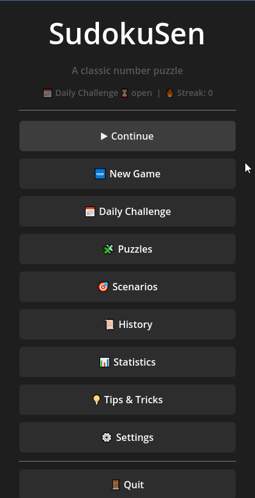
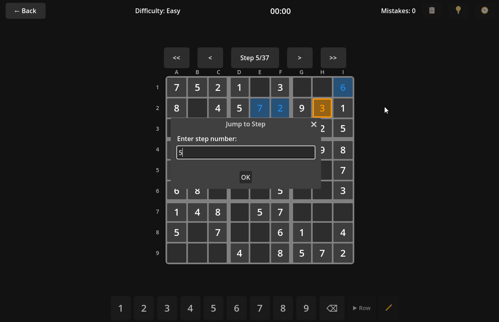
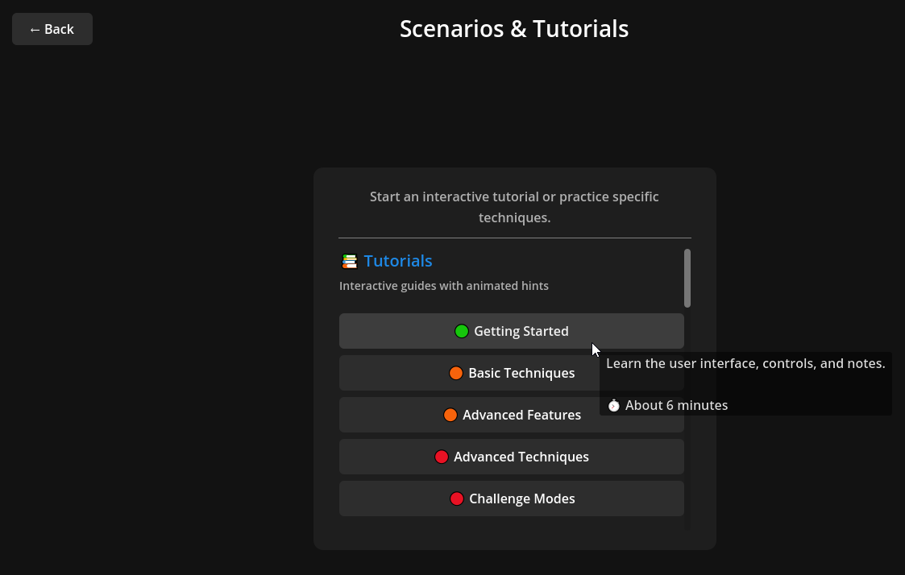
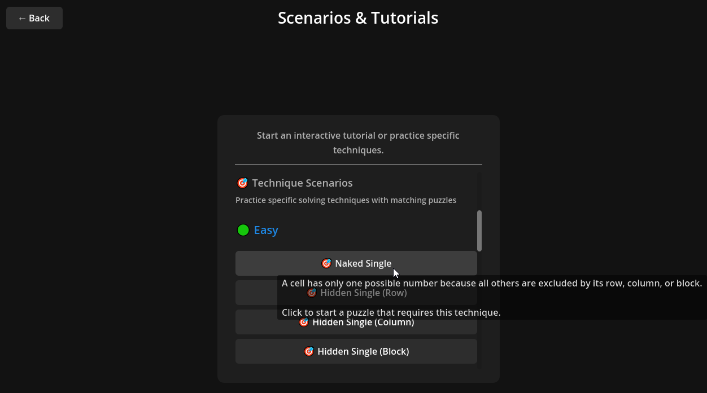
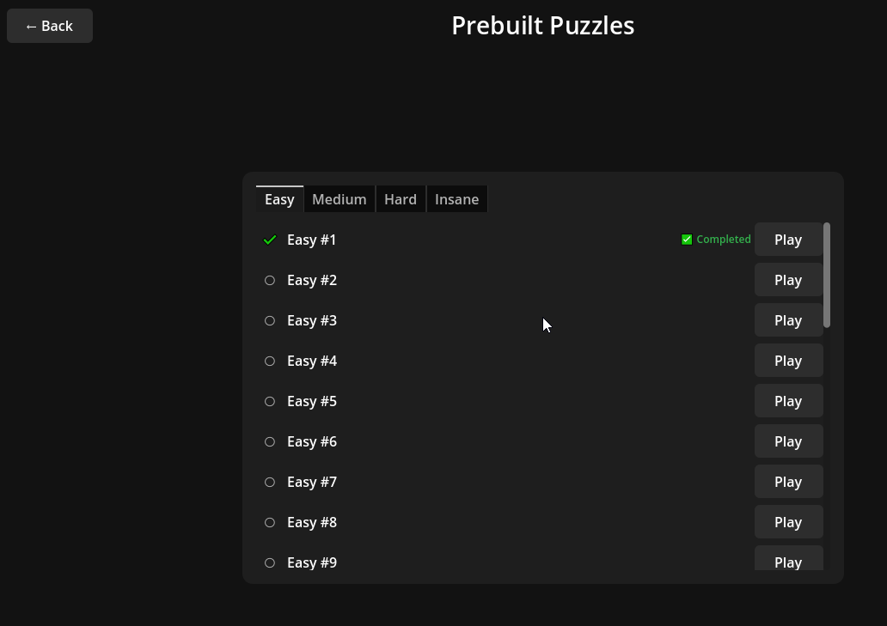
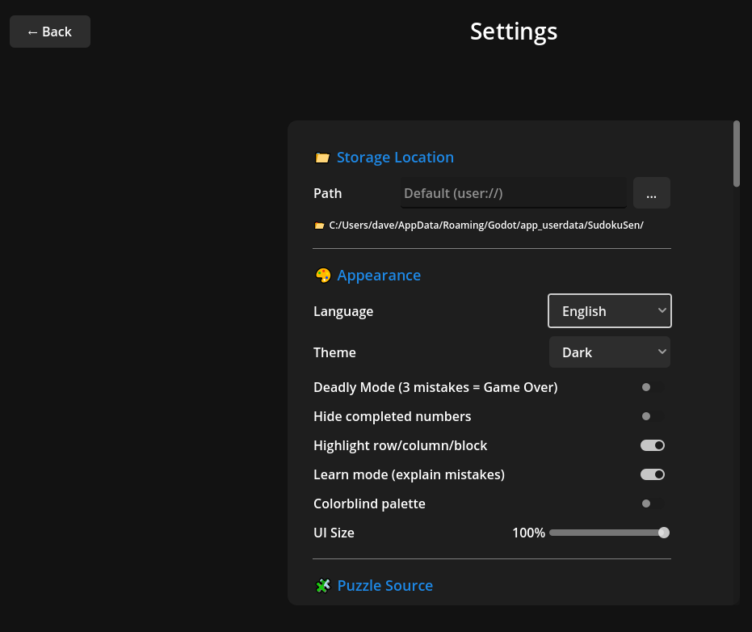

# SudokuSen v0.0.5 - Presentation

## 🎨 Menü-Icons für bessere Übersicht

### Alle Menüeinträge haben jetzt Icons!

| Menüpunkt | Icon |
|-----------|------|
| Weiterspielen | ▶️ |
| Neues Spiel | 🆕 |
| Tägliches Rätsel | 📅 |
| Szenarien | 🎯 |
| Tipps & Tutorials | 💡 |
| Puzzles | 🧩 |
| Historie | 📜 |
| Statistik | 📊 |
| Einstellungen | ⚙️ |
| Beenden | 🚪 |

---

## 🔄 Lösungspfad-Verbesserungen

### Toggle-Button

Der Lösungspfad-Button rechts oben funktioniert jetzt als Toggle:
- **Erster Klick**: Öffnet den Lösungspfad
- **Zweiter Klick**: Schließt den Lösungspfad

### Klickbare Lösungsschritte

Statt Hover-Tooltips gibt es jetzt ein **Detail-Panel**:
- Klicke auf einen Lösungsschritt
- Details erscheinen links neben dem Sudoku-Raster
- Panel passt sich automatisch an die Textlänge an

---

## 🧠 Menschenfreundliche Erklärungen

### Vorher (technisch):
> "Hidden Single: 6 kann in Zeile 1 nur in A2 stehen"

### Nachher (verständlich):
> "Die 6 kann nur in A2 stehen, weil die 6en bei B6, C9, F3 alle anderen Zellen blockieren."

### Was bedeutet das?

Die neuen Erklärungen zeigen **warum** eine Zahl nur an einer Stelle möglich ist:
- Referenziert die **blockierenden Zahlen** im Raster
- Verwendet **A1-Notation** (wie beim Schach)
- Macht die Logik **nachvollziehbar**

---

## 📍 A1-Notation erklärt

| Spalte | 1 | 2 | 3 | 4 | 5 | 6 | 7 | 8 | 9 |
|--------|---|---|---|---|---|---|---|---|---|
| Zeile A | A1 | A2 | A3 | A4 | A5 | A6 | A7 | A8 | A9 |
| Zeile B | B1 | B2 | B3 | ... | | | | | |
| ... | | | | | | | | | |
| Zeile I | I1 | I2 | I3 | I4 | I5 | I6 | I7 | I8 | I9 |

---

## 📜 Weitere Screenshots

### Spielhistorie

### Szenarien & Tutorials

### Vorgefertigte Puzzles

### Einstellungen

---

## 🔧 Bugfixes

- ✅ 15 fehlende Übersetzungsschlüssel für Hinweise hinzugefügt
- ✅ Doppelter Übersetzungsschlüssel entfernt
- ✅ Tägliches-Rätsel-Button zeigt Icon nicht mehr doppelt

---

## 🚀 Was kommt als Nächstes?

- Erweiterung der menschenfreundlichen Erklärungen auf andere Techniken
- Visuelle Hervorhebung der blockierenden Zellen im Raster
- Interaktive Lernfunktion für Lösungstechniken

---

**Viel Spaß mit den Verbesserungen!** 🎮✨
