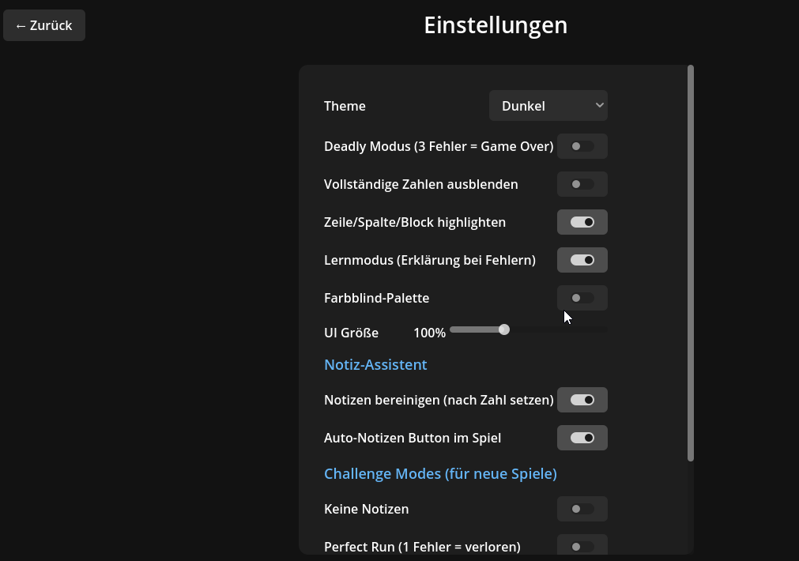
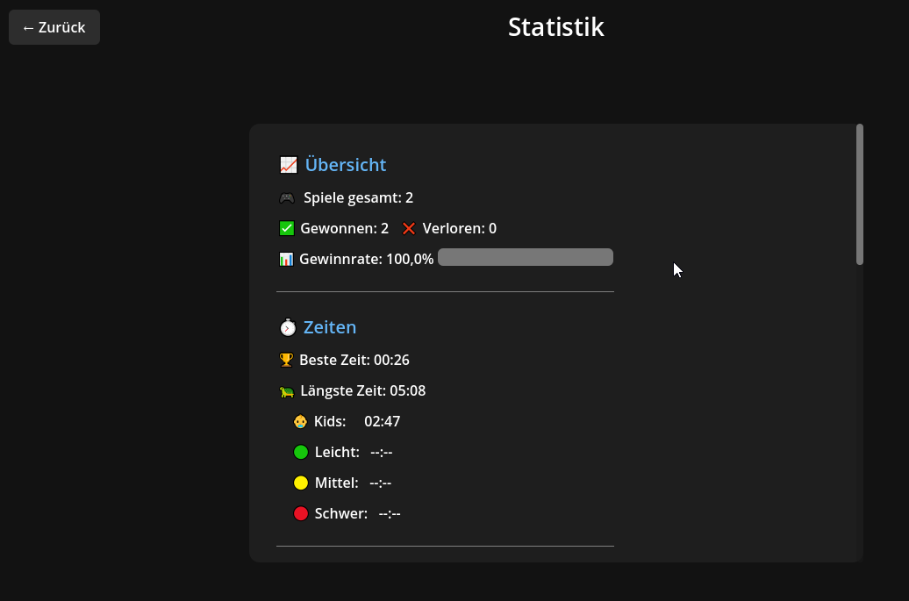

# 🧩 SudokuSen

**A modern Sudoku game built with Godot 4.5 & C#**

[](https://github.com/YOUR_USERNAME/SudokuSen/releases)
[](LICENSE)
[](https://godotengine.org/)


## ✨ Features

### 🎮 Game Modes
- **Classic Sudoku** - Traditional 9×9 puzzles
- **Kids Mode** - Simplified 4×4 grid for beginners
- **Daily Sudoku** - New puzzle every day with streak tracking
- **Scenarios** - Practice specific solving techniques

### 🏆 Challenge Modes
- **Deadly Mode** - 3 mistakes = Game Over
- **No Notes** - Solve without using candidates
- **Perfect Run** - Zero mistakes allowed
- **Hint Limit** - Limited hints per game
- **Time Attack** - Beat the clock

### 💡 Smart Features
- **Hint System** - Step-by-step explanations of solving techniques
- **Auto Candidates** - Automatic note/pencil mark management
- **Smart Cleanup** - Notes auto-update when you place numbers
- **Conflict Highlighting** - See mistakes immediately

### 🎨 Customization
- Light & Dark themes
- Colorblind-friendly palette
- Adjustable UI scaling
- Separate SFX & Music volume controls

### 📊 Progress Tracking
- Game history with replay
- Statistics per difficulty
- Mistake heatmap analysis
- Technique progression

## 📥 Download

**[⬇️ Download Latest Release](https://github.com/YOUR_USERNAME/SudokuSen/releases/latest)**

### System Requirements
- Windows 10/11 (64-bit)
- ~110 MB disk space

## 🎯 Screenshots

| Home Screen | Gameplay | Hints |
|-------------|----------|-------|
|  |  |  |

| Settings | Statistics | Kids Mode |
|----------|------------|-----------|
|  |  |  |

## 🎹 Controls

| Action | Keyboard | Mouse |
|--------|----------|-------|
| Navigate | Arrow Keys | Click cell |
| Place Number | 1-9 | Click number pad |
| Toggle Notes | N | Click Notes button |
| Delete | Backspace / Delete / 0 | Click eraser |
| Get Hint | H | Click 💡 button |
| Undo | Ctrl+Z | - |

## 🛠️ Building from Source

### Prerequisites
- [Godot 4.5.1 Mono](https://godotengine.org/download)
- [.NET 8 SDK](https://dotnet.microsoft.com/download/dotnet/8.0)

### Build Steps
```bash
# Clone the repository
git clone https://github.com/YOUR_USERNAME/SudokuSen.git
cd SudokuSen

# Build C# project
dotnet build

# Open in Godot Editor and run (F5)
```

### Deployment
```powershell
cd Deploy
.\Deploy.ps1
```

See [Deploy/README.md](Deploy/README.md) for detailed deployment instructions.

## 📄 Documentation

- [User Guide](Docs/Presentation/Presentation_0_0_1.md) - Complete gameplay guide
- [Solving Techniques](Docs/Techniques.md) - Learn Sudoku strategies
- [Changelog](Deploy/Changelog_0_0_1.md) - Version history

## 🤝 Contributing

Contributions are welcome! Please feel free to submit a Pull Request.

## 📜 License

This project is licensed under a **Personal Use License** – free for personal, non-commercial use. No redistribution or deployment allowed. See the [LICENSE](LICENSE) file for details.

## 🙏 Acknowledgments

- Built with [Godot Engine](https://godotengine.org/)
- Inspired by classic Sudoku games

---

**Happy Solving! 🧩**
